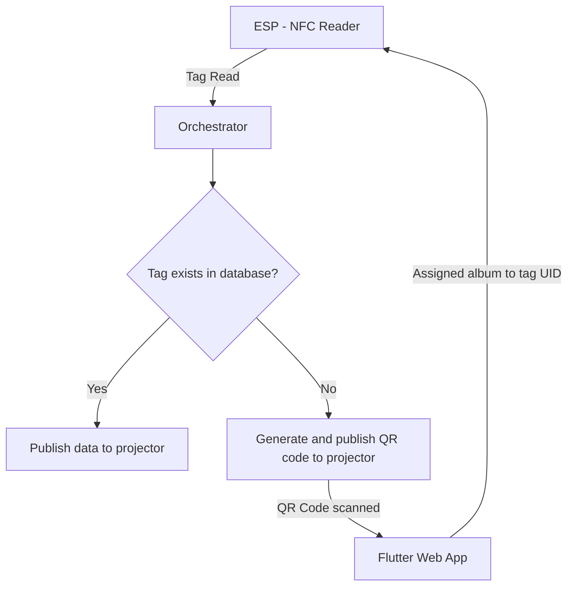

# Technologies

## Overview

```mermaid
flowchart TB

ESPNFC[ESP - NFC Reader]
Orchestrator[Orchestrator]
Flutter[Flutter Web App]

ESPNFC -->|Tag Read| Orchestrator

Orchestrator --> TagExists{Tag exists in database?}

TagExists -->|Yes| Publish[Publish data to projector]
TagExists -->|No| Generate[Generate and publish QR code to projector]

Generate -->|QR Code scanned| Flutter

Flutter -->|Assigned album to tag UID| ESPNFC
```

## Orchestrator

The orchestrator is in charge handling communication between the ESP NFC reader and everything else.